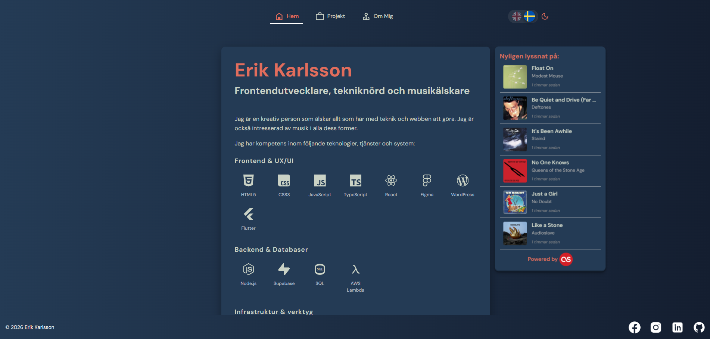
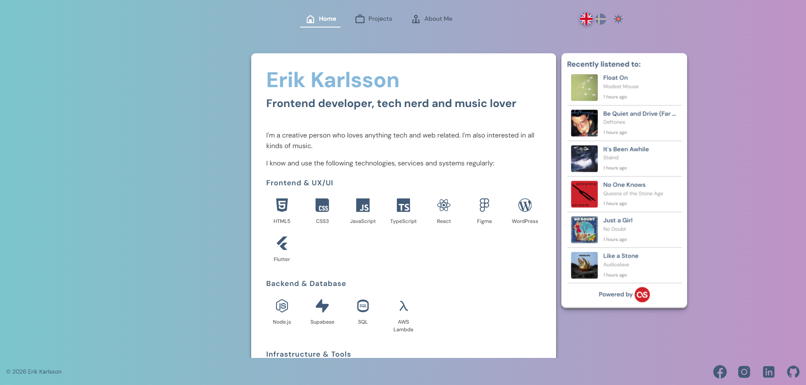
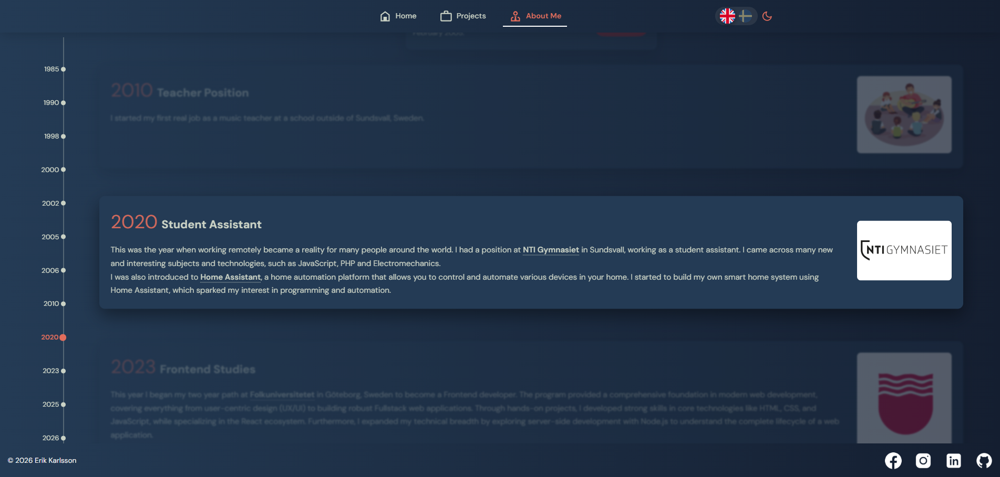

# Project Overview

## Introduction
This project is a Single Page Application (SPA) designed to showcase my profile, recent projects, and provide a means for contacting me.

## Views
### Home
The Home view provides visitors with a brief introduction to who I am, and a contact form at the bottom.

### Projects
The Projects view lists web projects and Youtube videos that I've made. Each project is presented with relevant details and links for further exploration.

### About Me
The About me section shows a timeline with life events concerning education, careers and interests.

## Technology Stack
- **Frontend Framework:** Utilizes a modern frontend framework (React) for building a responsive and interactive user interface. It also includes a button for switching between two background images, which utilizes React Redux.
- **API Integration:** Integrates with the Last.fm API to retrieve and display played tracks dynamically.
- **Material Design Icons:** Enhances the user experience by incorporating Material Design Icons, providing intuitive visual cues and enhancing the aesthetic appeal.
 
### To run the project locally, follow these steps:

1. Clone the repository to your local machine.
2. Navigate to the project directory.
3. Install necessary dependencies using "npm install" and "npm install @mdi/react".
4. Start the development server using npm run dev.
5. Access the application in your web browser at the specified localhost address.
